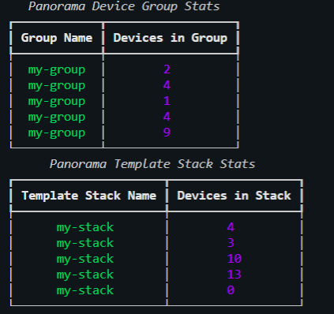

# Simple Table Print of Device Groups and Template Stacks

### Installation and virtual env

```bash
python3 -m venv myvenv
source myvenv/bin/activate
pip install rich
pip install requests
```
- Gather Token for Panorama, see [here](https://docs.paloaltonetworks.com/pan-os/9-0/pan-os-panorama-api/get-started-with-the-pan-os-xml-api/get-your-api-key)

This script uses rich and the request library to interact with the Panorama REST API. This example gathers the device groups and template stacks and prints a neat little table. See example tabel output below. 


